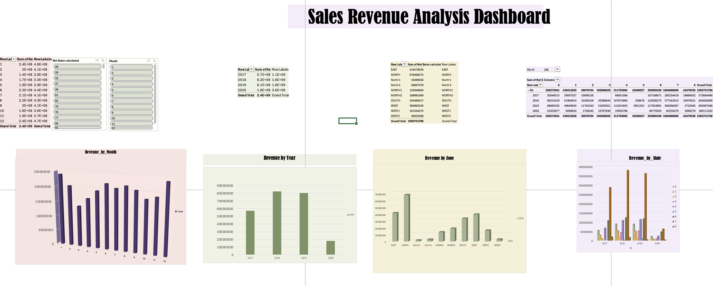

#  Sales & Revenue Analysis Dashboard

## Dashboard Preview

---

##  About

This project was developed as **Task 1** of the **Thiranex Data Analytics Internship**.

The objective was to build an interactive **Sales & Revenue Analysis Dashboard** in Microsoft Excel by importing a real-world sales dataset and visualizing key business metrics. The dashboard enables users to analyze revenue trends, compare sales across years, zones, and states, and gain actionable business insights using Pivot Tables, Pivot Charts, Filters, and Slicers.

The project focuses on transforming raw sales data into meaningful visualizations to support data-driven decision-making.
---

##  Project Objective

To build an interactive dashboard that helps businesses monitor sales performance, identify revenue trends, and make data-driven decisions through effective visualization techniques.

---

##  Dataset

The dashboard is built using a structured sales dataset containing information such as:

- Sales Amount
- Revenue
- Net Sales
- Year
- Month
- Zone
- State
- Site ID
- Product Categories

The dataset was imported into Microsoft Excel and analyzed using Pivot Tables and Pivot Charts.

---

##  Features

-  Revenue Analysis by Month
- Revenue Analysis by Year
-  Revenue Analysis by Zone
-  Revenue Analysis by State
-  Interactive Pivot Tables
-  Pivot Charts
-  Filters and Slicers for interactive exploration
-  Business-friendly dashboard layout

---

##  Tools Used

- Microsoft Excel
- Pivot Tables
- Pivot Charts
- Slicers
- Filters
- Data Visualization

---

##  Dashboard Insights

The dashboard provides insights such as:

- Monthly revenue trends
- Year-wise sales performance
- Zone-wise revenue comparison
- State-wise revenue distribution
- Interactive filtering for faster business analysis

---

##  Internship

This project was completed as part of the **Thiranex Data Analytics Internship** to strengthen practical skills in:

- Data Cleaning
- Data Visualization
- KPI Tracking
- Dashboard Design
- Business Analytics
- Reporting

---

##  Learning Outcomes

Through this project, I gained hands-on experience in:

- Importing and organizing datasets
- Building Pivot Tables
- Creating Pivot Charts
- Designing interactive dashboards
- Visualizing KPIs
- Generating business insights from sales data

---

##  Repository Contents

- `Sales-Revenue-Dashboard.xlsx` – Excel dashboard with Pivot Tables and Charts
- `Dashboard.png` – Dashboard preview image
- `README.md` – Project documentation

---

##  Author

**Ashwathi M**

GitHub: https://github.com/ashcodez11
